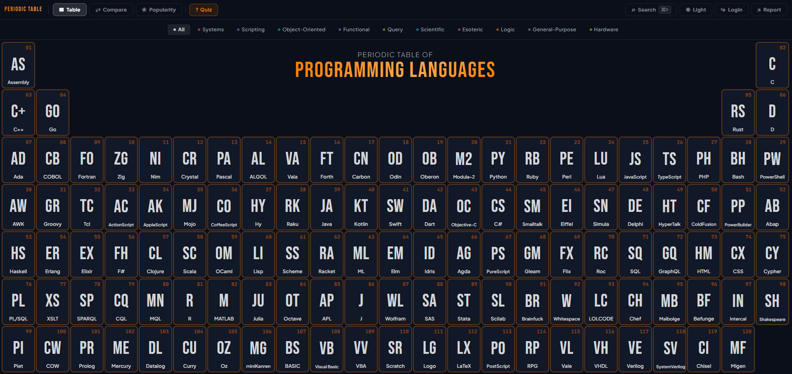
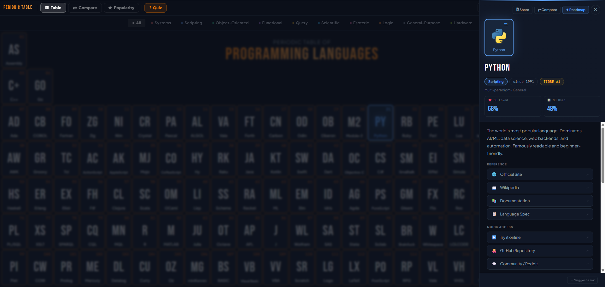
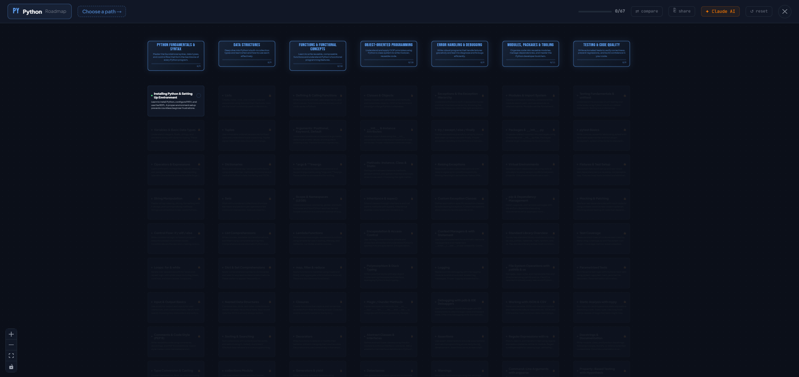
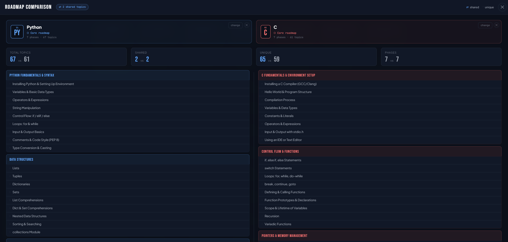
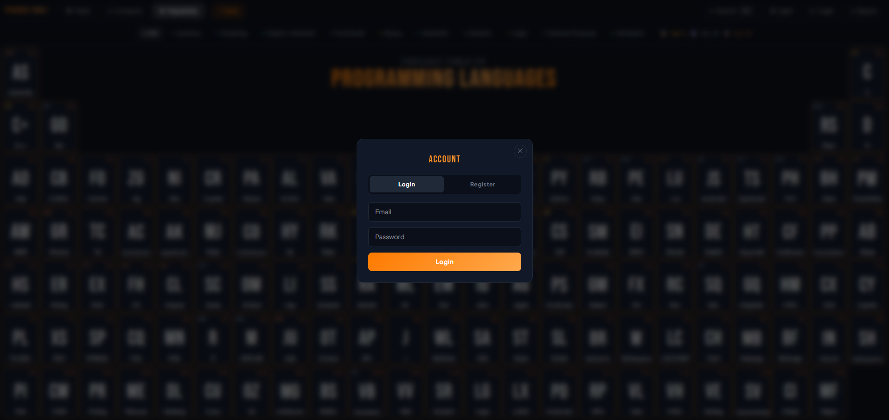

# Periodic Table of Programming Languages

An interactive reference for 120 programming languages, built as a periodic table. Browse languages, track your learning progress through AI-generated roadmaps, and compare paths side by side.

🌐 **Live at [tpl.pedrosmaia.com](https://tpl.pedrosmaia.com)** (soon)



---

## Features

- **Periodic table grid** — 120 languages organised by category, with filtering, keyboard navigation, and search (⌘K)
- **Language detail panel** — paradigm, year, description, links, tutorials, frameworks, tools and packages
- **AI-powered roadmaps** — structured learning paths generated by Claude AI, with phase and topic breakdown
- **Progress tracking** — mark topics as complete; progress syncs to your account across devices
- **Specialisation paths** — after completing the core roadmap, choose a specialisation (e.g. Web Frameworks, CLI Tools, etc.)
- **Roadmap comparison** — compare two roadmaps side by side, with shared/unique topic analysis
- **Quiz mode** — test your knowledge of programming languages
- **Popularity mode** — languages ranked by TIOBE index with Stack Overflow stats
- **Auth** — register and log in to persist progress across sessions and devices
- **Dark / Light mode**

---

## Screenshots

| Detail Panel | Roadmap |
|---|---|
|  |  |

| Compare | Auth |
|---|---|
|  |  |

---

## Stack

**Frontend**
- React 19 + Vite + Tailwind CSS
- React Flow (`@xyflow/react`) — roadmap graph
- Deployed as static build

**Backend**
- Laravel 12 + Filament v5 (admin panel)
- Laravel Sanctum (API authentication)
- Laravel Horizon (queue management)
- MySQL + Redis
- Claude API (Anthropic) — roadmap generation

---

## Local Development

### Prerequisites

- Docker + Docker Compose
- Node.js 20+
- Git

### 1. Clone the repository

```bash
git clone https://github.com/PedroSMaia/periodic-table-langs.git
cd periodic-table-langs
```

### 2. Configure environment variables

```bash
cp backend/.env.example backend/.env
```

Edit `backend/.env` and fill in:

```env
APP_KEY=          # will be generated in the next step
APP_URL=http://localhost:8000

DB_HOST=mysql
DB_DATABASE=ptl
DB_USERNAME=root
DB_PASSWORD=root

REDIS_HOST=redis

ANTHROPIC_API_KEY=   # required for roadmap generation
ADMIN_API_KEY=       # secret key for the /api/roadmap/{lang}/refresh endpoint
ADMIN_EMAILS=        # comma-separated emails allowed to access Filament admin
GITHUB_TOKEN=        # optional, for the "Suggest a link" feature
GITHUB_REPO=PedroSMaia/periodic-table-langs
```

> **Tip:** Generate a secure `ADMIN_API_KEY` with: `openssl rand -hex 32`

### 3. Start the containers

```bash
docker compose -f docker-compose.dev.yml up -d
```

This starts:
- `backend` — Laravel API on port 8000
- `frontend` — Vite dev server on port 5173
- `mysql` — MySQL 8
- `redis` — Redis
- `horizon` — Laravel Horizon (queue worker)

### 4. Install backend dependencies

On a fresh clone the `vendor/` directory won't exist. Install it before anything else:

```bash
docker compose -f docker-compose.dev.yml run --rm backend composer install
docker compose -f docker-compose.dev.yml up -d
```

### 5. Generate app key

```bash
docker exec periodic-table-langs-backend-1 php artisan key:generate
```

### 6. Install frontend dependencies

```bash
docker exec periodic-table-langs-frontend-1 npm install
docker exec periodic-table-langs-frontend-1 npm install html2canvas @xyflow/react
```

### 7. Run migrations and seed

```bash
docker exec periodic-table-langs-backend-1 php artisan migrate
docker exec periodic-table-langs-backend-1 php artisan db:seed
docker exec periodic-table-langs-backend-1 php artisan storage:link
```

### 8. Fetch popularity metrics

```bash
docker exec periodic-table-langs-backend-1 php artisan metrics:fetch
```

This scrapes the TIOBE index and merges it with Stack Overflow Developer Survey data into `storage/app/metrics.json`. The command is also scheduled to run **weekly** automatically via the Laravel scheduler.

### 9. Create an admin user

```bash
docker exec -it periodic-table-langs-backend-1 php artisan make:filament-user
```

Make sure the email matches one of the `ADMIN_EMAILS` in your `.env`.

> **Tip:** Verify Horizon is processing jobs: `docker exec periodic-table-langs-backend-1 php artisan horizon:status`

### 10. Open the app

| Service | URL |
|---|---|
| Frontend | http://localhost:5173 |
| Backend API | http://localhost:8000/api |
| Filament Admin | http://localhost:8000/manage-ptl (configurable via `FILAMENT_PATH`) |
| Horizon Dashboard | http://localhost:8000/horizon |

> **Note:** If you run the frontend outside Docker (e.g. `npm run dev` on the host), create `frontend/.env` with:
> ```env
> VITE_API_URL=http://localhost:8000
> ```
> Inside Docker this is not needed — the Vite dev server proxies `/api/*` to the backend automatically.

---

## Generating Roadmaps

Roadmaps are generated via the Claude API and cached in the database. Generation is triggered from the Filament admin panel or via the generation script.

### Using the script

```bash
cd backend

# Roadmaps only — tier 1 (Python, C, C++, Java, C#)
./scripts/generate-all.sh --tier1

# Roadmaps + top 5 paths — tier 1
./scripts/generate-all.sh --tier1 --paths

# Tier 2 (JS, Go, SQL, PHP, TypeScript, Rust, Kotlin, Swift, R, MATLAB, Ruby, Dart, Scala, Perl, Visual Basic)
./scripts/generate-all.sh --tier2

# Tier 2 with paths
./scripts/generate-all.sh --tier2 --paths

# Tier 3 (Lua, Haskell, Elixir, Clojure, Julia, Groovy, PowerShell, Assembly, Bash, F#)
./scripts/generate-all.sh --tier3

# All tiers
./scripts/generate-all.sh --paths
```

> **Note:** Before running, flush the Redis queue to avoid stale jobs:
> ```bash
> docker exec periodic-table-langs-redis-1 redis-cli FLUSHDB
> ```

> **Cost estimate:** Each roadmap costs ~$1–2 in Claude API credits. Each path costs ~$0.50–1.

### Using the Filament admin

1. Go to `http://localhost:8000/manage-ptl` (or your configured `FILAMENT_PATH`)
2. Navigate to **Languages → View** for any language
3. Click **Regenerate Roadmap** to queue a roadmap generation
4. In the **Roadmap Paths** section, click **Generate** on individual paths or **Generate All Missing**

---

## Production Deployment

### 1. Configure environment

```bash
cp .env.example .env
```

Edit `.env` and fill in:

```env
APP_KEY=                          # generated automatically on first start
APP_URL=https://your-domain.com

DB_PASSWORD=                      # openssl rand -base64 32
DB_ROOT_PASSWORD=                 # openssl rand -base64 32

ADMIN_API_KEY=                    # openssl rand -hex 32
ADMIN_EMAILS=your@email.com
ANTHROPIC_API_KEY=                # optional, for roadmap generation
```

### 2. Build and start

```bash
docker compose up -d --build
```

This starts:
- `frontend` — nginx serving static build + API proxy (port 80)
- `backend` — Laravel with auto-migrations, config caching, and cron scheduler
- `horizon` — queue worker for background jobs
- `mysql` — with persistent volume
- `redis` — with AOF persistence

### 3. First-time setup

```bash
# Generate app key
docker compose exec backend php artisan key:generate

# Seed the database
docker compose exec backend php artisan db:seed

# Fetch popularity metrics
docker compose exec backend php artisan metrics:fetch

# Create admin user
docker compose exec -it backend php artisan make:filament-user
```

### What's included automatically

- **Migrations** run on container start
- **Config/route/view caching** applied on start
- **Cron scheduler** runs `metrics:fetch` weekly
- **Health checks** on MySQL before backend starts

### Manual build (without Docker)

```bash
# Frontend — generate static build
cd frontend && npm ci && npm run build

# Backend — cache configuration for performance
cd backend
composer install --no-dev --optimize-autoloader
php artisan config:cache
php artisan route:cache
php artisan view:cache
```

---

## Useful Commands

```bash
# Fetch/refresh popularity metrics (TIOBE + Stack Overflow)
docker exec periodic-table-langs-backend-1 php artisan metrics:fetch

# Run the Laravel scheduler manually (executes all due scheduled tasks)
docker exec periodic-table-langs-backend-1 php artisan schedule:run

# List all scheduled tasks
docker exec periodic-table-langs-backend-1 php artisan schedule:list

# Clear application cache
docker exec periodic-table-langs-backend-1 php artisan cache:clear

# Import roadmap JSON files from storage/app/roadmaps/ into the database
docker exec periodic-table-langs-backend-1 php artisan roadmap:import

# Import a single language
docker exec periodic-table-langs-backend-1 php artisan roadmap:import --lang=Python

# Import path details from storage/app/roadmap-paths/ into the database
docker exec periodic-table-langs-backend-1 php artisan roadmap:import-paths

# Import paths for a single language
docker exec periodic-table-langs-backend-1 php artisan roadmap:import-paths --lang=Python

# Check Horizon queue status
docker exec periodic-table-langs-backend-1 php artisan horizon:status

# View container logs
docker compose -f docker-compose.dev.yml logs -f backend
docker compose -f docker-compose.dev.yml logs -f frontend
```

---

## Resetting the database

If you need to reset roadmap data after restarting containers:

```bash
docker exec periodic-table-langs-redis-1 redis-cli FLUSHALL
docker exec periodic-table-langs-mysql-1 mysql -u root -proot ptl -e "TRUNCATE TABLE roadmaps; TRUNCATE TABLE roadmap_paths;"
```

---

## Project Structure

```
periodic-table-langs/
├── backend/                    # Laravel 12 API
│   ├── app/
│   │   ├── Console/Commands/   # Artisan commands (metrics:fetch, etc.)
│   │   ├── Filament/           # Admin panel resources and widgets
│   │   ├── Http/Controllers/   # API controllers
│   │   ├── Jobs/               # Queue jobs (roadmap generation)
│   │   └── Models/
│   ├── scripts/
│   │   └── generate-all.sh     # Bulk roadmap generation script
│   ├── routes/
│   │   ├── api.php             # API routes
│   │   └── console.php         # Scheduled tasks
│   └── storage/app/metrics.json # TIOBE + SO survey data (auto-generated)
└── frontend/                   # React 19 + Vite
    └── src/
        ├── components/         # UI components
        ├── hooks/              # Custom hooks (useRoadmap, useAuth, etc.)
        └── data/               # Language data
```

---

## License

MIT
